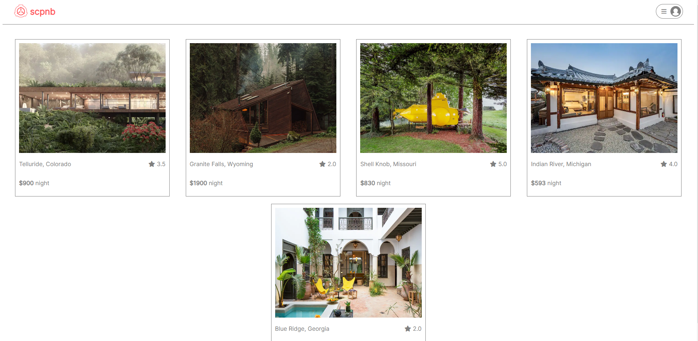
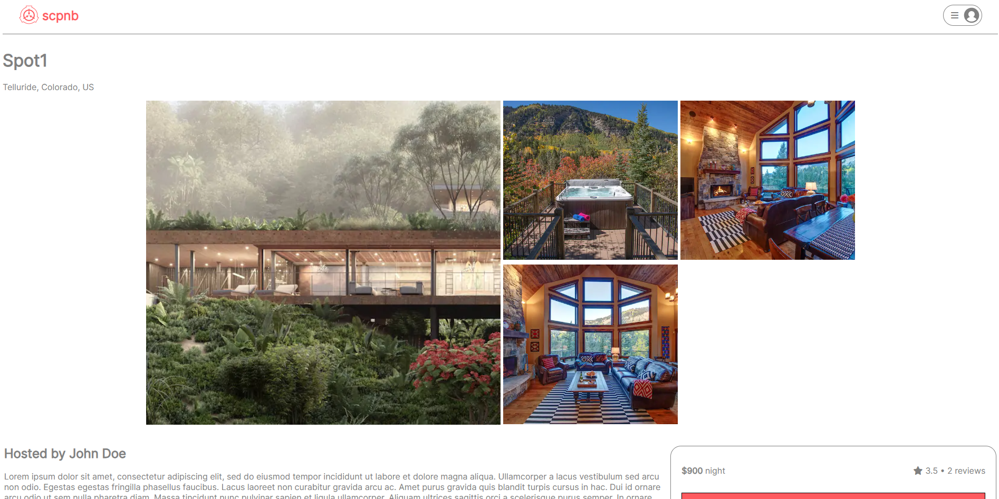

# SCPnB

A clone of the AirBnB website.

[Live Site](https://scpnb.onrender.com/)

---

## Technologies Used


---

## Photos

### Landing Page



### Single Spot



---

## Getting Started

1. Clone this repository.

2. Install denpendencies for both the frontend and backend using the `npm install` command.

3. Create a .env file using the .env.example provided.

4. Set up the database by running the following commands:

   ```
   npx dotenv sequelize db:create
   npx dotenv sequelize db:migrate
   npx dotenv sequelize db:seed:all
   ```

5. Start both the backend and frontend servers by running the `npm start` command.

6. Website should be served on whatever port you specified in the `.env` file.
